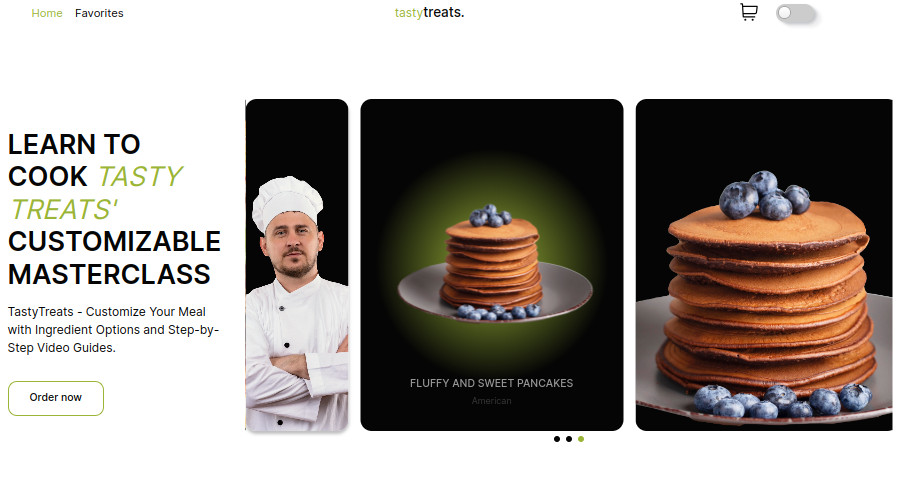
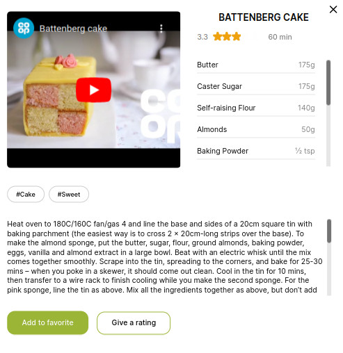

# tastytreats

## Description

**The tastytreats project provides developers with a convenient solution for
accessing an extensive database of culinary recipes. The API enables integration
of website functionality into applications or web services.**

## Getting Started

1. Clone the repository:

```
git clone https://github.com/ishkov2709/tastytreats.git
```

2. Navigate to the project directory:

```
cd tastytreats
```

3. Install dependencies:

```
npm install
```

4. Run the application:

```
npm start
```

## Project Structure

**src**:

- **css**: Styles
- **fonts**: Fonts
- **images**: Images
- **js/renders**: Dynamic Renders
- **js/servise**: API Functions
- **js/servise**: Utils Functions
- **partials**: HTML Partials

## Demo

 

## Used Libraries

**_Frontend_**

- **Vanilla JS**
- **Parcel**
- **animate.css**
- **Axios**
- **body-scroll-lock**
- **lodash**
- **styled-components**
- **smooth-scrollbar**
- **Swiper**
- **tui-pagination**
